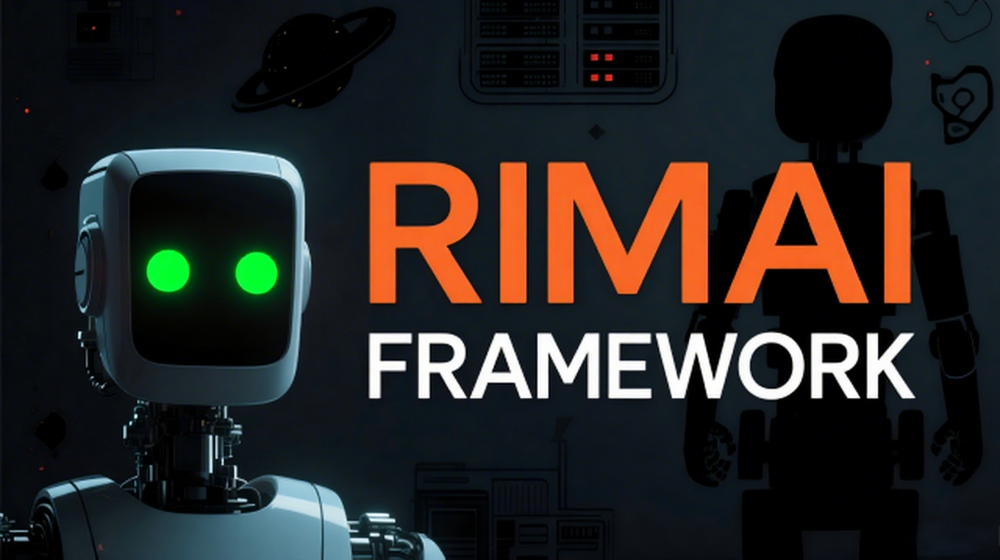

# 🤖 RimAI 框架 🏛️

[🇺🇸 English](README.md) | [🇨🇳 简体中文](README_zh-CN.md) | [📚 文档](docs/)

[](https://opensource.org/licenses/MIT)
[](https://rimworldgame.com/)
[](https://dotnet.microsoft.com/download/dotnet-framework)
[](https://steamcommunity.com/sharedfiles/filedetails/?id=3529263357)
[](https://steamcommunity.com/sharedfiles/filedetails/?id=3529186453)

> **🚀 一个革命性的AI驱动的RimWorld框架，将大语言模型直接集成到您的殖民地管理体验中，实现智能化、上下文感知的行政决策！🎮✨**

**🎉 现已在Steam创意工坊发布！** 🎉  
**[📥 下载RimAI框架](https://steamcommunity.com/sharedfiles/filedetails/?id=3529263357)**

**👨‍💻 作者**: [@oidahdsah0](https://github.com/oidahdsah0)  
**📅 创建时间**: 2025年7月15日  
**🚀 发布时间**: 2025年7月19日

---

## 🚀 **愿景：智能殖民地管理** 🧠

RimAI框架通过**"无摩擦交互"** 🌊 引入了殖民地管理的范式转变——无需殖民者聚集到特定地点或中断他们的工作来处理行政任务。管理通过集中化的**"AI行政终端"** 🖥️，采用异步、智能化的命令处理来实现。

您的决策成为"智能指令" ⚡，在不干扰殖民地生产力的情况下无缝影响世界。后果通过殖民者的想法 💭、对话气泡 💬、社交日志 📋 和全局消息 📢 呈现，创造出由先进AI分析驱动的智能化且极其高效的治理体验！🎯

## 📐 **三层架构** 🏗️

为了创建清晰且可扩展的生态系统，RimAI项目被组织成三个不同的层次：

### 1. **🔧 框架层**（本仓库）✅
- **🎯 目的**：纯粹的技术后端和通信层
- **📋 职责**：
  - 所有大语言模型（LLM）网络通信 ✅
  - API密钥管理、请求构建、响应解析和错误处理 ✅
  - ⚡ API请求的异步处理和并发控制 ✅
  - 🔍 嵌入系统，用于语义搜索和上下文理解 🚧
  - 📚 RAG（检索增强生成）知识库集成 🚧
  - 🌳 JSON树层次结构RAG库支持 🚧
- **🎮 目标**：绝对中立、稳定且高效。不包含任何游戏逻辑。✅

### 2. **⚔️ 核心游戏模块**（未来仓库）🚧
- **🎯 目的**：定义核心游戏体验的官方内容包
- **📋 职责**：
  - 具体的游戏系统，如"司法系统" ⚖️ 和"殖民地编年史" 📖
  - 通过XML和C#定义特定的案例类型、AI工具和游戏事件监听器
  - 为玩家交互界面填充UI 🖱️
- **🎮 类比**：类似于RimWorld的"Core"内容，具有独立"DLC"模块的潜力

### 3. **🎭 AI叙事者**（未来集成）🚧
- **🎯 目的**：由先进AI分析驱动的智能叙事指导者
- **📋 职责**：
  - 带有AI增强的标准RimWorld `StorytellerDef`实现 🤖
  - 对殖民地状态和玩家行为进行持续AI驱动分析 📊
  - 基于智能模式识别的动态事件生成 🎲
- **🎮 目标**：真正自适应的、AI驱动的叙事体验，与您的殖民地共同发展！🌟

## 🎯 **核心功能** 🌟

### 🖥️ AI行政终端
- **🏛️ 单一智能中心**：一个可建造的核心结构解锁整个RimAI系统
- **🎛️ 集成UI**：用于不同管理任务的多标签终端界面：
  - **📁 案件档案**：以档案格式处理刑事案件和民事纠纷
  - **📜 行政法典**：发布全球行政法令和永久法律
  - **👥 AI顾问内阁**：任命和管理您的AI驱动官员
  - **📚 殖民地档案**：访问历史记录和统计数据
  - **🤖 W.I.F.E. 系统**：监护人集成预见引擎——您的AI顾问委员会

### ⚖️ 智能化治理
- **📋 案件登记**：犯罪和纠纷自动创建带有AI分析期限的时间戳案件 ⏰
- **🔍 智能档案审查**：通过AI增强的界面随时处理案件
- **🧠 智能判决**：通过AI驱动的推理和上下文分析发布决定
- **🤖 AI法官代理**：未处理的案件由AI指定官员自动处理
- **⚡ 智能后果**：结果通过AI分析的思想、社交变化和环境反应传播

### 👨‍💼 AI官员系统
- **⚖️ AI法官**：通过智能分析处理逾期案件并通过信件报告 📝
- **🏛️ AI管家**：基于智能殖民地状态分析提供行政建议
- **🎤 AI议长**：基于AI驱动的事件分析提出立法改进

## 🛠️ **技术实现** ⚙️

### 🔧 核心技术
- **🪶 轻量级**: 除游戏本体和 Newtonsoft.Json 外无外部依赖。**不需要 Harmony**。🚀
- **🧩 ThingComp**：对象特定数据和行为的组件系统
- **🌐 GameComponent**：全局数据管理和持久存储
- **📝 自定义Defs**：新的XML可定义概念（`ToolDef`、`CaseDef`）
- **⚙️ ModSettings**：玩家可配置选项和API管理

### 🗂️ 关键类
- 🤖 `LLMManager`：AI通信和智能响应处理的单例
- ⚙️ `RimAISettings`：配置管理和AI模型持久化
- 🧠 `ContextManager`：智能游戏状态分析和AI上下文构建
- 📚 `CoreDefs`：框架级定义和AI驱动的数据结构

## 🔧 **安装和设置** 📦

### 📋 前置要求
- 🎮 RimWorld 1.6+

### 💾 安装

#### 🎮 **对于玩家（推荐）**
1. **📥 Steam创意工坊**：[订阅RimAI框架](https://steamcommunity.com/sharedfiles/filedetails/?id=3529263357)
2. **🔧 启用模组**：启动RimWorld并在模组列表中启用"RimAI Framework"
3. **⚙️ 配置**：在模组选项中设置您的API凭证

#### �‍💻 **对于开发者**
1. **📂 手动安装**：从[GitHub发布页面](https://github.com/oidahdsah0/Rim_AI_Framework/releases)下载
2. **� 从源代码构建**：克隆并本地构建（见下方开发设置）
3. **⚙️ 配置**：设置您的开发环境和API设置

### ⚙️ 配置
1. 🎮 打开RimWorld > 选项 > 模组设置 > RimAI Framework
2. 🔑 输入您的LLM API凭证：
   - **🔐 API密钥**：您的OpenAI/Claude/本地模型API密钥
   - **🌐 端点URL**：服务端点（默认为OpenAI）
   - **🤖 模型名称**：要使用的特定模型（例如，`gpt-4o`）
3. 🔍 配置可选的嵌入设置以增强上下文

## 🌍 **支持的语言** 🗣️

框架包含完整的本地化支持：
- 🇺🇸 English（英语）
- 🇨🇳 **简体中文**
- 🇯🇵 日本語（日语）
- 🇰🇷 한국어（韩语）
- 🇫🇷 Français（法语）
- 🇩🇪 Deutsch（德语）
- 🇷🇺 Русский（俄语）

## 🤝 **贡献** 👥

这是一个开源项目，欢迎贡献！🎉 请查看我们的[贡献指南](CONTRIBUTING.md)了解详情。

### 👨‍💻 开发设置
1. **📂 克隆仓库**
   ```bash
   git clone https://github.com/oidahdsah0/Rim_AI_Framework.git
   cd Rim_AI_Framework
   ```

2. **🔨 构建项目**
   ```bash
   # 进入框架目录
   cd RimAI.Framework
   
   # 使用dotnet CLI构建（跨平台）
   dotnet build
   
   # 或在Windows上使用MSBuild
   msbuild Rim_AI_Framework.sln /p:Configuration=Debug
   ```

3. **📋 开发要求**
   - 🛠️ .NET Framework 4.7.2 SDK
   - 💻 Visual Studio 2019+ 或带有C# Dev Kit的VS Code
   - 🎮 RimWorld 1.6+（用于测试）

4. **🍎 macOS构建注意事项**
   - 使用`dotnet build`命令（macOS上不可用MSBuild）
   - 项目自动检测macOS RimWorld安装路径 🎯
   - 需要Mono运行时（通常随.NET SDK一起安装）
   - PostBuild事件直接部署到RimWorld Mods文件夹 📂

### 🏗️ 仓库结构
- **📝 仅源代码**：此仓库仅包含源代码
- **🔨 本地构建**：开发者应从源代码构建
- **✨ 干净的Git**：不提交编译后的二进制文件到仓库
- **📦 发布版本**：预编译的模组在GitHub发布页面提供

### 📚 架构文档
- 🏗️ [技术设计](docs/TECHNICAL_DESIGN.md)
- 📖 [API参考](docs/API_REFERENCE.md)
- 📋 [实现指南](docs/IMPLEMENTATION_GUIDE.md)

## 📄 **许可证** ⚖️

此项目采用MIT许可证 - 查看[LICENSE](LICENSE)文件了解详情。

## 🙏 **致谢** ❤️

- 🎮 RimWorld社区的灵感和支持
- 👥 所有贡献者和早期采用者

---

## ⚙️ **基础设置指南** 🔧

**⚠️ 重要：在使用任何RimAI模块前，您必须配置Mod设置！**

### 📋 **详细配置步骤**

1. **安装并启用**
   - 在Steam创意工坊订阅RimAI Framework
   - 在Mod列表中启用该模组并重启边缘世界

2. **进入Mod设置**
   - 前往 **设置 → Mod设置 → RimAI Framework**
   - 您将看到包含多个需要填写字段的配置面板

3. **配置必填字段**

   **� API Key**（云服务必需）：
   - **OpenAI**：从 https://platform.openai.com/api-keys 获取
   - **Ollama（本地）、vLLM**：留空 - 无需密钥
   - 完全按照服务商提供的密钥复制粘贴

   **� Endpoint URL**（必填）：
   ```
   OpenAI用户：  https://api.openai.com/v1（Deepseek、Siliconflow设置类似）
   本地Ollama：  http://localhost:11434/v1
   其他服务商：  请查看提供商文档
   ```

   **🤖 模型名称**（必填）：
   ```
   OpenAI：     gpt-4o-mini, gpt-4o, gpt-3.5-turbo
   Ollama：     llama3.2:3b, qwen2.5:7b, mistral:7b（你已安装的模型）
   ```

   **🔄 启用流式传输**（可选）：
   - ✅ **推荐**：勾选以获得实时响应
   - ❌ 取消勾选获得单次完整响应

4. **测试并保存**
   - 使用 **测试连接** 按钮验证您的设置
   - 点击 **保存** 应用您的配置
   - 现在您可以使用RimAI模块了！

### 💡 **新手推荐设置**

**🆓 免费方案（本地AI）**：
- 在您的电脑上安装Ollama
- 下载 `llama3.2:3b` 模型
- URL：`http://localhost:11434/v1`
- API Key：（留空）
- 模型：`llama3.2:3b`

**💰 经济方案（云端AI）**：
- 注册OpenAI账户
- URL：`https://api.openai.com/v1`
- 从OpenAI仪表板获取API密钥
- 模型：`gpt-4o-mini`（非常实惠：每100万token约￥1）

**⭐ 高级方案**：
- 使用 `gpt-4o` 获得最佳效果，或尝试Deepseek、Siliconflow等经济替代方案

---

**⚠️ 免责声明**：这是一个框架级模组，需要额外的内容模块才能实现完整功能。核心游戏功能（司法系统、殖民地编年史等）将作为单独的模块发布。🚧

**🔗 链接**：
- 🎮 **[Steam创意工坊 - 现已发布！](https://steamcommunity.com/sharedfiles/filedetails/?id=3529263357)** ⭐
- 💬 [Discord服务器](https://discord.gg/TBD)（即将推出）
- 🐛 [错误报告与问题](https://github.com/oidahdsah0/Rim_AI_Framework/issues)
- 📖 [GitHub仓库](https://github.com/oidahdsah0/Rim_AI_Framework)
- 📋 [更新日志](https://github.com/oidahdsah0/Rim_AI_Framework/releases)
