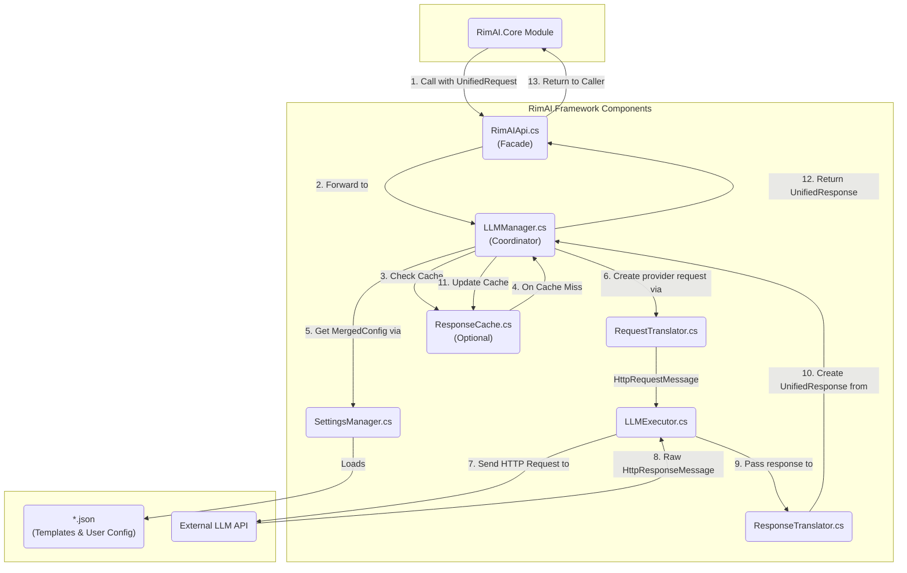

# RimAI.Framework V4 架构设计

## 1. 核心思想

首先，以下几个内容是确定的：

1. 不同 LLM API 供应商都使用相同的规范模板，用户填写的配置会在加载模板的基础上形成新文件保存；
2. 提供非流式、流式的普通对话接口（加载各模板）；
3. 提供非流式、流式的JSON格式接口（加载各模板）；
4. 提供非流式的Function Call接口（加载各模板）；
5. 提供自定义模板填写；
6. 考虑异步、HttpClient生命周期；

Framework V4 旨在构建一个高度灵活、可扩展、数据驱动的底层基础设施，用于与各类大语言模型（LLM）API 进行交互。其核心特性包括：

*   **提供商模板系统**: 通过外部化的 `provider_template_*.json` 文件来定义与特定 LLM API（如 OpenAI, Google Gemini, Anthropic Claude, 以及自定义服务）的交互方式，实现对新提供商的快速适配，无需修改框架代码。
*   **统一的内部模型**: 所有外部请求都被转换为统一的内部请求对象 (`UnifiedRequest`)，所有来自 LLM 的响应也都被翻译回统一的内部响应对象 (`UnifiedResponse`)，从而解耦上层业务与底层 API 的实现细节。
*   **清晰的职责分层**: 框架内部严格划分为 API 门面、核心协调、配置管理、请求/响应翻译、HTTP 执行、缓存等独立组件，各司其职。
*   **全面的功能支持**: 原生支持非流式、流式、JSON 模式和工具调用（Function Calling）等多种交互模式。
*   **内部依赖注入**: 使用一个轻量级的、纯代码的“一次性装配线” (`FrameworkDI`) 来创建和组装其所有内部组件，实现高内聚、低耦合。

## 2. 目录结构与组件职责

基于上述思想和具体功能需求，V4 的目录结构设计如下。这个结构旨在实现关注点分离，并明确每个组件的单一职责。

```
RimAI.Framework/
└── Source/
    ├── API/
    │   └── RimAIApi.cs          # [公共API] 静态门面，提供给 Core 模块调用的唯一入口。包含流式/非流式/JSON/Tool-Calling接口。
    │
    ├── Core/
    │   ├── Lifecycle/
    │   │   └── FrameworkDI.cs   # [核心-生命周期] 内部DI容器。在Mod加载时“一次性”创建并连接所有内部服务。
    │   │
    │   └── LLMManager.cs        # [核心-协调] 内部总协调器。接收API请求，调用配置、翻译、执行和缓存等服务，完成一次完整的LLM交互。
    │
    ├── Configuration/
    │   ├── Models/
    │   │   ├── ProviderTemplate.cs # [配置-模型] C#类，对应 provider_template_*.json 的结构。包含端点、认证、请求/响应格式等所有适配规则。
    │   │   ├── UserConfig.cs    # [配置-模型] C#类，对应 user_config_*.json 的结构。包含API-Key、模型选择等用户配置。
    │   │   └── MergedConfig.cs  # [配置-模型] 内部只读对象，由一个UserConfig和一个ProviderTemplate合并而成，作为单次请求的“全量配置”。
    │   │
    │   └── SettingsManager.cs   # [配置-服务] 负责加载、解析、验证、合并和缓存所有 `provider` 和 `user` 配置文件。
    │
    ├── Translation/
    │   ├── Models/
    │   │   ├── UnifiedRequest.cs  # [翻译-模型] 内部统一请求对象。包含内容、对话历史、以及可选的Tool定义。
    │   │   ├── UnifiedResponse.cs # [翻译-模型] 内部统一响应对象。包含内容、FinishReason、以及可选的ToolCall。
    │   │   └── ToolingModels.cs   # [翻译-模型] 包含 ToolDefinition 和 ToolCall 等与工具调用相关的模型。
    │   │
    │   ├── RequestTranslator.cs   # [翻译-服务] (请求翻译器) 根据 MergedConfig，将 UnifiedRequest 翻译成特定于提供商的 HttpRequestMessage。
    │   └── ResponseTranslator.cs  # [翻译-服务] (响应翻译器) 根据 MergedConfig，将原始 HttpResponseMessage 翻译回 UnifiedResponse，支持流式和非流式。
    │
    ├── Execution/
    │   ├── Models/
    │   │   └── RetryPolicy.cs   # [执行-模型] 定义重试策略（次数、退避算法等），可由 ProviderTemplate 配置。
    │   │
    │   ├── HttpClientFactory.cs # [执行-基础设施] 创建和管理 HttpClient 实例，遵循最佳实践。
    │   └── LLMExecutor.cs       # [执行-服务] 负责发送 HttpRequestMessage、接收 HttpResponseMessage，并应用重试策略。
    │
    ├── Caching/
    │   └── ResponseCache.cs     # [缓存-服务] (可选) 为非流式请求提供响应缓存，减少重复API调用和成本。
    │
    └── Shared/
        ├── Exceptions/
        │   ├── FrameworkException.cs
        │   ├── ConfigurationException.cs
        │   └── LLMException.cs
        │
        └── Logging/
            └── RimAILogger.cs     # [共享-日志] 统一的日志记录工具。
```

## 3. 架构图与数据流

下图展示了 Framework V4 的核心组件以及一次完整的非流式 API 调用的数据流。注意：图中展示的是数据流动的逻辑顺序，实际的调用由 LLMManager 作为中心协调者统一发起。



## 4. 关键设计决策与风险考量

在最终确定架构时，我们明确了以下几个关键的设计原则和风险对策，以确保框架的健壮性和可维护性。

### a. LLMManager 作为唯一的“总协调者”

尽管数据流图呈现了组件间的逻辑顺序，但在实现层面，`LLMManager` 是唯一的**总协调者 (Coordinator)**。它将按顺序调用其他服务，而不是形成一个调用链。具体流程如下：

1.  `LLMManager` 调用 `SettingsManager` 获取 `MergedConfig`。
2.  `LLMManager` 调用 `RequestTranslator` 将 `UnifiedRequest` 翻译成 `HttpRequestMessage`。
3.  `LLMManager` 将 `HttpRequestMessage` 交给 `LLMExecutor` 执行，并接收返回的 `HttpResponseMessage`。
4.  `LLMManager` 将 `HttpResponseMessage` 交给 `ResponseTranslator` 翻译成 `UnifiedResponse`。

这种模式确保了翻译、执行等组件的职责单一，且完全解耦。

### b. 强制性的提供商模板验证 (Template Validation)

`ProviderTemplate.json` 的正确性是整个框架数据驱动能力的核心。为了防止因配置错误导致运行时异常，`SettingsManager` 承担以下额外职责：

*   **加载时验证**: 在加载和反序列化任何 `provider_template_*.json` 文件后，必须立即对其进行严格的验证。
*   **明确的错误报告**: 验证失败时，必须抛出一个包含详细信息的 `ConfigurationException`，明确指出是**哪个文件**的**哪个字段**不符合规范。这将极大地简化用户和第三方开发者的调试过程。

### c. 配置保存的职责边界

需求中“用户填写的配置会在加载模板的基础上形成新文件保存”被界定为**配置时 (Configuration-Time)** 的操作，而非**请求时 (Request-Time)** 的操作。

*   **请求时**: 在处理 API 调用时，`LLMManager` 从 `SettingsManager` 获取的是在**内存中**动态合并的 `MergedConfig` 实例，不涉及任何文件 I/O。
*   **配置时**: 用户在 Mod 设置界面中进行修改和保存的操作，应由 UI 相关的代码负责。它可以选择仅更新 `user_config_*.json`，或根据需要将合并结果持久化为新文件。该逻辑与核心的 API 请求处理流程完全分离。
