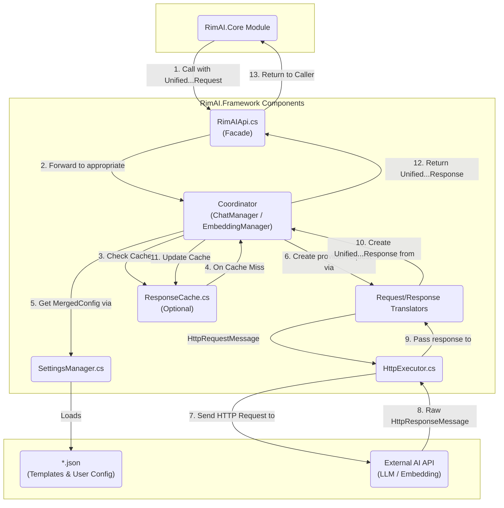

# RimAI.Framework V4 架构设计

## 1. 核心思想 - 这是一个 RimWorld 游戏的 AI API 对接框架Mod

首先，以下几个内容是确定的：

1.  不同 LLM API 供应商都使用相同的规范模板，用户填写的配置会在加载模板的基础上形成新文件保存；
2.  提供非流式、流式的普通对话接口（加载各模板）；
3.  提供非流式、流式的JSON格式接口（加载各模板）；
4.  提供非流式的Function Call接口（加载各模板）；
5.  **[新增]** 提供非流式的 Embedding 接口；
6.  **[新增]** 对普通对话和 Embedding 接口提供批量处理能力；
7.  提供自定义模板填写；
8.  严格考虑异步、HttpClient生命周期；

Framework V4 旨在构建一个高度灵活、可扩展、数据驱动的底层基础设施，用于与各类大语言模型（LLM）及 Embedding API 进行交互。其核心特性包括：

*   **【更新】提供商模板系统**: 通过外部化的 `provider_template_*.json` 文件，不仅定义与特定AI服务的交互方式，更定义了**API的完整契约**。这包括端点、认证方法、以及**请求/响应的结构映射**，从而实现对新提供商的零代码适配。
*   **统一的内部模型**: 所有外部请求都被转换为统一的内部请求对象 (`UnifiedChatRequest`, `UnifiedEmbeddingRequest`)，所有来自 AI 的响应也都被翻译回统一的内部响应对象 (`UnifiedChatResponse`, `UnifiedEmbeddingResponse`)，从而解耦上层业务与底层 API 的实现细节。
*   **清晰的职责分层**: 框架内部严格划分为 API 门面、核心协调器（区分 Chat 和 Embedding）、配置管理、请求/响应翻译、HTTP 执行、缓存等独立组件，各司其职。
*   **全面的功能支持**: 原生支持聊天（流式/非流式）、JSON 模式、工具调用（Function Calling）以及文本嵌入（Text Embedding）。
*   **智能批量处理**: 为 Embedding 提供基于 API 限制的自动分块批量处理，为聊天提供基于用户配置的并发处理。
*   **内部依赖注入**: 使用一个轻量级的、纯代码的“一次性装配线” (`FrameworkDI`) 来创建和组装其所有内部组件，实现高内聚、低耦合。

## 2. 目录结构与组件职责

基于上述思想和具体功能需求，V4 的目录结构设计如下。这个结构旨在实现关注点分离，并明确每个组件的单一职责。

```
RimAI.Framework/
└── Source/
    ├── API/
    │   └── RimAIApi.cs          # [公共API] 静态门面，提供给 Core 模块调用的唯一入口。包含所有 Chat/Embedding/Tool-Calling 接口。
    │
    ├── Core/
    │   ├── Lifecycle/
    │   │   └── FrameworkDI.cs   # [核心-生命周期] 内部DI容器。在Mod加载时“一次性”创建并连接所有内部服务。
    │   │
    │   ├── ChatManager.cs       # [核心-协调] (原LLMManager) 聊天功能总协调器。负责并发控制。
    │   └── EmbeddingManager.cs  # [核心-协调] [新增] Embedding功能总协调器。负责原生批量分块。
    │
    ├── Configuration/
    │   ├── Models/
    │   │   ├── ProviderTemplate.cs # 【更新】[配置-模型] C#类，对应 provider_template_*.json 的结构。包含所有API的适配规则，如：请求/响应的路径映射、工具调用结构、JSON模式定义、静态参数等。
    │   │   ├── UserConfig.cs    # [配置-模型] C#类，对应 user_config_*.json 的结构。包含API-Key、并发数等用户配置（需分别考虑Chat和Embedding）。
    │   │   └── MergedConfig.cs  # [配置-模型] 内部只读对象，由一个UserConfig和一个ProviderTemplate合并而成，作为单次请求的“全量配置”。
    │   │
    │   └── SettingsManager.cs   # [配置-服务] 负责加载、解析、验证、合并和缓存所有 `provider` 和 `user` 配置文件。
    │
    ├── Translation/
    │   ├── Models/
    │   │   ├── UnifiedChatModels.cs  # [翻译-模型] 包含 UnifiedChatRequest 和 UnifiedChatResponse。
    │   │   ├── UnifiedEmbeddingModels.cs # [翻译-模型] [新增] 包含 UnifiedEmbeddingRequest 和 UnifiedEmbeddingResponse。
    │   │   └── ToolingModels.cs      # [翻译-模型] 包含 ToolDefinition 和 ToolCall 等与工具调用相关的模型。
    │   │
    │   ├── ChatRequestTranslator.cs    # [翻译-服务] (请求翻译器) 将 UnifiedChatRequest 翻译成特定于提供商的 HttpRequestMessage。
    │   ├── ChatResponseTranslator.cs   # [翻译-服务] (响应翻译器) 将原始 HttpResponseMessage 翻译回 UnifiedChatResponse，支持流式和非流式。
    │   ├── EmbeddingRequestTranslator.cs  # [翻译-服务] [新增] 将 UnifiedEmbeddingRequest 翻译成特定于提供商的 HttpRequestMessage。
    │   └── EmbeddingResponseTranslator.cs # [翻译-服务] [新增] 将原始 HttpResponseMessage 翻译回 UnifiedEmbeddingResponse。
    │
    ├── Execution/
    │   ├── Models/
    │   │   └── RetryPolicy.cs   # [执行-模型] 定义重试策略（次数、退避算法等），可由 ProviderTemplate 配置。
    │   │
    │   ├── HttpClientFactory.cs # [执行-基础设施] 创建和管理 HttpClient 实例，遵循最佳实践。
    │   └── HttpExecutor.cs      # [执行-服务] (原LLMExecutor) 负责发送 HttpRequestMessage、接收 HttpResponseMessage，并应用重试策略。
    │
    ├── Caching/
    │   └── ResponseCache.cs     # [缓存-服务] 为非流式 Chat 和 Embedding 请求提供响应缓存，减少重复API调用和成本。
    │
    └── Shared/
        ├── Exceptions/
        │   ├── FrameworkException.cs
        │   ├── ConfigurationException.cs
        │   └── LLMException.cs
        │
        └── Logging/
            └── RimAILogger.cs     # [共享-日志] 统一的日志记录工具。
```

## 3. 架构图与数据流

下图展示了 Framework V4 的通用组件交互模型。注意：图中展示的是数据流动的逻辑顺序，实际的调用由**中心协调器** (`ChatManager` / `EmbeddingManager`) 统一发起。



## 4. 关键设计决策与风险考量

在最终确定架构时，我们明确了以下几个关键的设计原则和风险对策，以确保框架的健壮性和可维护性。

### a. 中心协调者模式 (Coordinator Pattern)

每个核心功能（Chat, Embedding）都有一个专属的**协调器 (Coordinator)**。例如, `ChatManager` 是所有聊天功能的总协调者。它将按顺序调用其他服务，而不是形成一个调用链。具体流程如下：

1.  `ChatManager` 调用 `SettingsManager` 获取 `MergedConfig`。
2.  `ChatManager` 调用 `ChatRequestTranslator` 将 `UnifiedChatRequest` 翻译成 `HttpRequestMessage`。
3.  `ChatManager` 将 `HttpRequestMessage` 交给 `HttpExecutor` 执行，并接收返回的 `HttpResponseMessage`。
4.  `ChatManager` 将 `HttpResponseMessage` 交给 `ChatResponseTranslator` 翻译成 `UnifiedChatResponse`。

这种模式确保了翻译、执行等组件的职责单一，且完全解耦。

### b. 强制性的提供商模板验证 (Template Validation)

`ProviderTemplate.json` 的正确性是整个框架数据驱动能力的核心。为了防止因配置错误导致运行时异常，`SettingsManager` 承担以下额外职责：

*   **加载时验证**: 在加载和反序列化任何 `provider_template_*.json` 文件后，必须立即对其进行严格的验证。
*   **明确的错误报告**: 验证失败时，必须抛出一个包含详细信息的 `ConfigurationException`，明确指出是**哪个文件**的**哪个字段**不符合规范。这将极大地简化用户和第三方开发者的调试过程。

### c. 配置保存的职责边界

需求中“用户填写的配置会在加载模板的基础上形成新文件保存”被界定为**配置时 (Configuration-Time)** 的操作，而非**请求时 (Request-Time)** 的操作。

*   **请求时**: 在处理 API 调用时，协调器从 `SettingsManager` 获取的是在**内存中**动态合并的 `MergedConfig` 实例，不涉及任何文件 I/O。
*   **配置时**: 用户在 Mod 设置界面中进行修改和保存的操作，应由 UI 相关的代码负责。它可以选择仅更新 `user_config_*.json`，或根据需要将合并结果持久化为新文件。该逻辑与核心的 API 请求处理流程完全分离。

### d. 统一的返回类型 (`Result<T>`) 模式

为了在整个框架中建立一套统一、健壮且清晰的错误处理机制，我们引入了 `Result<T>` 设计模式。所有可能失败但失败属于“意料之中”（如文件未找到、API返回错误码）的操作，都将返回一个 `Result` 对象，而不是直接抛出异常或返回 `null`。

*   **目的**: 强制调用者显式处理失败情况，从根源上杜绝 `NullReferenceException`，并使代码逻辑更清晰。
*   **结构**: `Result` 对象将包含操作是否成功的标志 (`IsSuccess`)、成功时的返回值 (`Value`) 或失败时的错误信息 (`Error`)。
*   **应用**: 框架内的所有服务接口（如 `SettingsManager.GetMergedConfig`, `HttpExecutor.ExecuteAsync` 等）都会使用 `Result<T>` 作为其返回类型，从而形成一个健壮、可预测的调用链。

## 5. [新增] 核心功能详解：Embedding 与批量处理

### 5.1 Embedding API 支持

为了将 Embedding 作为一等公民集成到框架中，我们引入了一套并行的、专用的组件。

*   **专用组件**: `EmbeddingManager` (协调器), `EmbeddingRequestTranslator`, `EmbeddingResponseTranslator` (翻译器), 以及 `UnifiedEmbeddingModels` (数据模型)。
*   **数据驱动配置**: `ProviderTemplate.json` 将新增一个 `embeddingApi` 字段，用于定义与 Embedding API 交互所需的所有信息。这包括端点、默认模型，以及用于指导翻译器工作的请求/响应路径映射。

**【更新】`ProviderTemplate.json` 中配置示例 (以OpenAI为例):**
```json
{
  "providerName": "OpenAI",
  "http": {
    "authHeader": "Authorization",
    "authScheme": "Bearer"
  },
  "chatApi": {
    "endpoint": "https://api.openai.com/v1/chat/completions",
    "defaultModel": "gpt-4o",
    "requestPaths": {
      "model": "model",
      "messages": "messages"
    },
    "responsePaths": {
      "choices": "choices",
      "content": "message.content"
    }
  },
  "embeddingApi": {
    "endpoint": "https://api.openai.com/v1/embeddings",
    "defaultModel": "text-embedding-3-small",
    "maxBatchSize": 2048,
    "requestPaths": {
      "model": "model",
      "input": "input"
    },
    "responsePaths": {
      "dataList": "data",
      "embedding": "embedding",
      "index": "index"
    }
  },
  "staticParameters": {
    "some_static_root_field": "some_value"
  }
}
```

### 5.2 批量处理策略 (Batch Processing Strategy)

框架通过两种不同的策略来高效地处理批量请求，以最大化吞吐量和资源利用率。

#### a. 原生批量 (Native Batching) - 主要用于 Embedding

当底层API原生支持在单次请求中处理多项输入时（如大多数 Embedding API），框架将采用此策略。

*   **触发**: 调用 `RimAIApi.GetEmbeddingsAsync(List<string> inputs, ...)`。
*   **协调者**: `EmbeddingManager`。
*   **流程**:
    1.  `EmbeddingManager` 从 `MergedConfig` 中获取提供商定义的 `maxBatchSize`。
    2.  如果输入的 `inputs` 列表大小超过 `maxBatchSize`，管理器会将其自动分割成多个更小的数据块（Chunks）。
    3.  管理器会为**每个数据块**调用 `EmbeddingRequestTranslator`，生成一个包含该数据块所有输入的`HttpRequestMessage`。
    4.  并发地将所有生成的 `HttpRequestMessage` 发送出去（可以使用 `HttpExecutor`），并收集结果。
    5.  最终，将所有数据块的结果合并，并按原始顺序返回。

#### b. 并发控制 (Concurrency Control) - 主要用于 Chat

当底层API不支持原生批量时（如大多数 Chat API），框架将通过并发请求来模拟批量处理。

*   **触发**: 调用 `RimAIApi.GetCompletionsAsync(List<UnifiedChatRequest> requests, ...)`。
*   **协调者**: `ChatManager`。
*   **流程**:
    1.  `ChatManager` 从 `MergedConfig` 中获取用户定义的 `concurrencyLimit`。
    2.  管理器使用一个 `SemaphoreSlim`（或其他并发控制机制），其初始计数设置为 `concurrencyLimit`。
    3.  它会遍历 `requests` 列表，为每个 `UnifiedChatRequest` 启动一个处理任务。
    4.  每个任务在开始执行前，都必须先从 `SemaphoreSlim` 获取一个许可。
    5.  任务完成（或失败）后，必须释放许可。
    6.  这确保了在任何时刻，最多只有 `concurrencyLimit` 个HTTP请求在同时进行。
