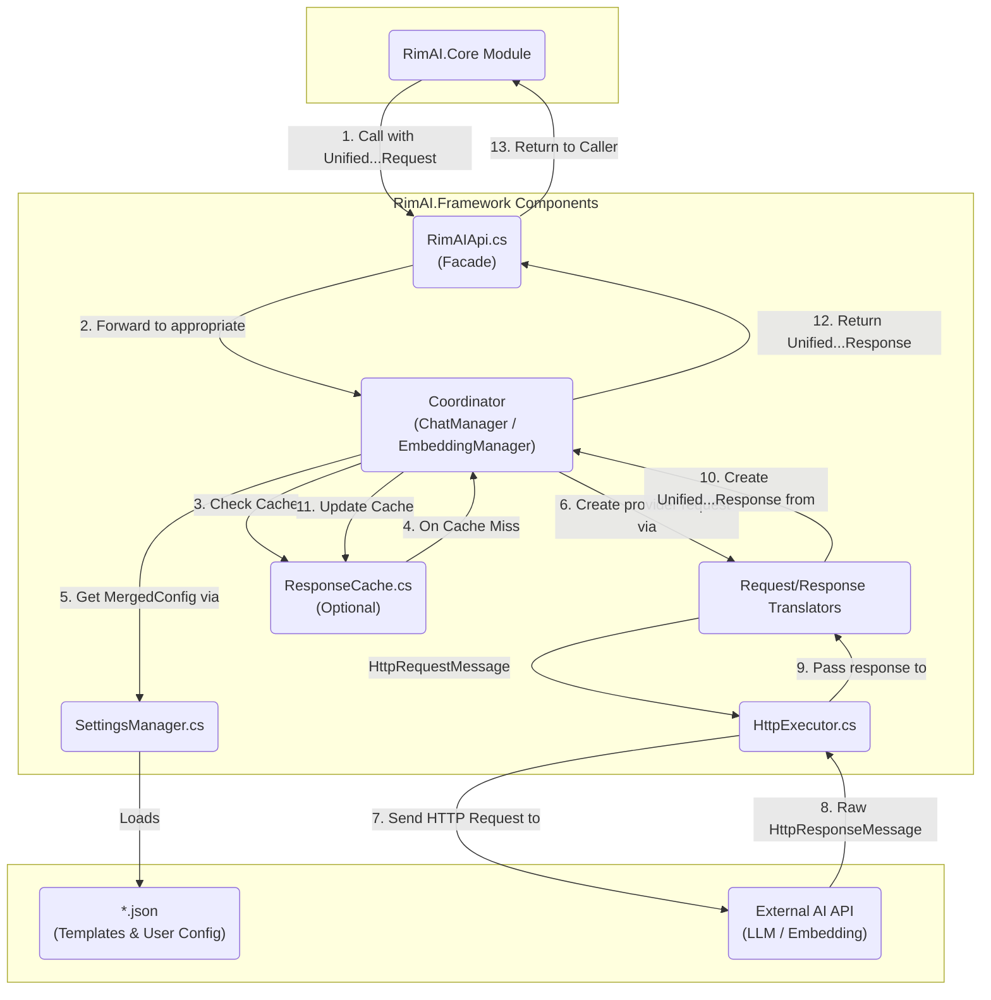

# RimAI.Framework V4 架构设计

## 1. 核心思想 - 这是一个 RimWorld 游戏的 AI API 对接框架Mod

首先，以下几个内容是确定的：

1.  不同 LLM API 供应商都使用相同的规范模板，用户填写的配置会在加载模板的基础上形成新文件保存；
2.  提供非流式、流式的普通对话接口（加载各模板）；
3.  提供非流式、流式的JSON格式接口（加载各模板）；
4.  提供非流式的Function Call接口（加载各模板）；
5.  **[新增]** 提供非流式的 Embedding 接口；
6.  **[新增]** 对普通对话和 Embedding 接口提供批量处理能力；
7.  提供自定义模板填写；
8.  严格考虑异步、HttpClient生命周期；

Framework V4 旨在构建一个高度灵活、可扩展、数据驱动的底层基础设施，用于与各类大语言模型（LLM）及 Embedding API 进行交互。其核心特性包括：

*   **【更新】提供商模板系统**: 通过外部化的 `provider_template_*.json` 文件，不仅定义与特定AI服务的交互方式，更定义了**API的完整契约**。这包括端点、认证方法、以及**请求/响应的结构映射**，从而实现对新提供商的零代码适配。
*   **统一的内部模型**: 所有外部请求都被转换为统一的内部请求对象 (`UnifiedChatRequest`, `UnifiedEmbeddingRequest`)，所有来自 AI 的响应也都被翻译回统一的内部响应对象 (`UnifiedChatResponse`, `UnifiedEmbeddingResponse`)，从而解耦上层业务与底层 API 的实现细节。
*   **清晰的职责分层**: 框架内部严格划分为 API 门面、核心协调器（区分 Chat 和 Embedding）、配置管理、请求/响应翻译、HTTP 执行、缓存等独立组件，各司其职。
*   **全面的功能支持**: 原生支持聊天（流式/非流式）、JSON 模式、工具调用（Function Calling）以及文本嵌入（Text Embedding）。
*   **智能批量处理**: 为 Embedding 提供基于 API 限制的自动分块批量处理，为聊天提供基于用户配置的并发处理。
*   **内部依赖注入**: 使用一个轻量级的、纯代码的“一次性装配线” (`FrameworkDI`) 来创建和组装其所有内部组件，实现高内聚、低耦合。

## 2. 目录结构与组件职责

基于上述思想和具体功能需求，V4 的目录结构设计如下。这个结构旨在实现关注点分离，并明确每个组件的单一职责。

```
RimAI.Framework/
└── Source/
    ├── API/
    │   └── RimAIApi.cs                  # [公共API] 整个框架的静态门面，供外部调用。
    │
    ├── Configuration/
    │   ├── Models/
    │   │   ├── ChatModels.cs            # [配置-模型] 定义与聊天服务相关的配置模型 (模板、用户配置、合并后配置)。
    │   │   └── EmbeddingModels.cs       # [配置-模型] 定义与Embedding服务相关的配置模型。
    │   ├── BuiltInTemplates.cs          # [配置-服务] 提供内置的、作为代码后备的提供商模板。
    │   └── SettingsManager.cs           # [配置-服务] 负责加载、解析、合并和管理所有提供商和用户配置文件。
    │
    ├── Core/
    │   ├── Lifecycle/
    │   │   └── FrameworkDI.cs           # [核心-生命周期] 轻量级静态DI容器，用于在启动时组装所有服务。
    │   ├── ChatManager.cs               # [核心-协调] 聊天功能总协调器，负责处理业务逻辑流程和并发控制。
    │   └── EmbeddingManager.cs          # [核心-协调] Embedding功能总协调器，负责处理业务逻辑流程和批量分块。
    │
    ├── Execution/
    │   ├── Models/
    │   │   └── RetryPolicy.cs           # [执行-模型] 定义HTTP请求重试策略的数据模型。
    │   ├── Cache/                       # [执行-缓存] 统一响应缓存与同请求合流（in-flight de-dup）
    │   │   ├── ICacheService.cs
    │   │   ├── MemoryCacheService.cs
    │   │   ├── IInFlightCoordinator.cs
    │   │   └── InFlightCoordinator.cs
    │   ├── HttpClientFactory.cs         # [执行-基础设施] 管理HttpClient实例的生命周期，确保最佳实践。
    │   └── HttpExecutor.cs              # [执行-服务] 负责发送HTTP请求并应用重试策略。
    │
    ├── Shared/
    │   ├── Exceptions/
    │   │   ├── ConfigurationException.cs # [共享-异常] 配置相关的自定义异常。
    │   │   ├── FrameworkException.cs     # [共享-异常] 框架的通用基础异常。
    │   │   └── LLMException.cs           # [共享-异常] AI服务返回错误时的自定义异常。
    │   ├── Logging/
    │   │   └── RimAILogger.cs             # [共享-日志] 一个简单的静态日志记录工具。
    │   └── Models/
    │       └── Result.cs                # [共享-模型] 封装操作结果的通用包装类，用于显式处理成功或失败。
    │
    ├── Translation/
    │   ├── Models/
    │   │   ├── ToolingModels.cs         # [翻译-模型] 定义工具调用(Function Calling)相关的内部统一模型。
    │   │   ├── UnifiedChatModels.cs     # [翻译-模型] 定义框架内部统一的聊天请求和响应模型。
    │   │   └── UnifiedEmbeddingModels.cs # [翻译-模型] 定义框架内部统一的Embedding请求和响应模型。
    │   ├── ChatRequestTranslator.cs     # [翻译-服务] 将内部统一聊天请求翻译成特定于提供商的HttpRequestMessage。
    │   ├── ChatResponseTranslator.cs    # [翻译-服务] 将HttpResponseMessage翻译回内部统一聊天响应。
    │   ├── EmbeddingRequestTranslator.cs # [翻译-服务] 将内部统一Embedding请求翻译成特定于提供商的HttpRequestMessage。
    │   └── EmbeddingResponseTranslator.cs # [翻译-服务] 将HttpResponseMessage翻译回内部统一Embedding响应。
    │
    └── UI/
        ├── RimAIFrameworkMod.cs         # [UI] Mod设置窗口的主类，负责绘制UI和处理用户交互。
        └── RimAIFrameworkSettings.cs    # [UI] 继承自ModSettings，负责持久化存储Mod的各项设置。
```

### Contracts 稳定层

`RimAI.Framework.Contracts` 是框架的 **“接口与 DTO 稳定层”** ：

* 为 **所有组件** 提供统一且可复用的数据模型 (DTO)，例如 `UnifiedChatModels`, `UnifiedEmbeddingModels`；
* 暴露 **通用 Result<T> 错误包装器**，使上层服务具备一致的错误处理模式；
* 本身 **零依赖**，可被 `RimAI.Framework`、`RimAI.Core` 及第三方 Mod 安全引用；
* 若需扩展接口，应 **先** 在 Contracts 中添加或调整模型，再在其他层实现其逻辑。

目录示例：
```text
RimAI.Framework.Contracts/
└── Models/
    ├── Result.cs
    ├── UnifiedChatModels.cs
    ├── UnifiedEmbeddingModels.cs
    └── ToolingModels.cs
```

## 3. 架构图与数据流

下图展示了 Framework V4 的通用组件交互模型。注意：图中展示的是数据流动的逻辑顺序，实际的调用由**中心协调器** (`ChatManager` / `EmbeddingManager`) 统一发起。



## 4. 关键设计决策与风险考量

在最终确定架构时，我们明确了以下几个关键的设计原则和风险对策，以确保框架的健壮性和可维护性。

### a. 中心协调者模式 (Coordinator Pattern)

每个核心功能（Chat, Embedding）都有一个专属的**协调器 (Coordinator)**。例如, `ChatManager` 是所有聊天功能的总协调者。它将按顺序调用其他服务，而不是形成一个调用链。具体流程如下：

1.  `ChatManager` 调用 `SettingsManager` 获取 `MergedConfig`。
2.  `ChatManager` 调用 `ChatRequestTranslator` 将 `UnifiedChatRequest` 翻译成 `HttpRequestMessage`。
3.  `ChatManager` 将 `HttpRequestMessage` 交给 `HttpExecutor` 执行，并接收返回的 `HttpResponseMessage`。
4.  `ChatManager` 将 `HttpResponseMessage` 交给 `ChatResponseTranslator` 翻译成 `UnifiedChatResponse`。

这种模式确保了翻译、执行等组件的职责单一，且完全解耦。

### b. 强制性的提供商模板验证 (Template Validation)

`ProviderTemplate.json` 的正确性是整个框架数据驱动能力的核心。为了防止因配置错误导致运行时异常，`SettingsManager` 承担以下额外职责：

*   **加载时验证**: 在加载和反序列化任何 `provider_template_*.json` 文件后，必须立即对其进行严格的验证。
*   **明确的错误报告**: 验证失败时，必须抛出一个包含详细信息的 `ConfigurationException`，明确指出是**哪个文件**的**哪个字段**不符合规范。这将极大地简化用户和第三方开发者的调试过程。

### c. 配置保存的职责边界

需求中“用户填写的配置会在加载模板的基础上形成新文件保存”被界定为**配置时 (Configuration-Time)** 的操作，而非**请求时 (Request-Time)** 的操作。

*   **请求时**: 在处理 API 调用时，协调器从 `SettingsManager` 获取的是在**内存中**动态合并的 `MergedConfig` 实例，不涉及任何文件 I/O。
*   **配置时**: 用户在 Mod 设置界面中进行修改和保存的操作，应由 UI 相关的代码负责。它可以选择仅更新 `user_config_*.json`，或根据需要将合并结果持久化为新文件。该逻辑与核心的 API 请求处理流程完全分离。

### d. 统一的返回类型 (`Result<T>`) 模式

为了在整个框架中建立一套统一、健壮且清晰的错误处理机制，我们引入了 `Result<T>` 设计模式。所有可能失败但失败属于“意料之中”（如文件未找到、API返回错误码）的操作，都将返回一个 `Result` 对象，而不是直接抛出异常或返回 `null`。

*   **目的**: 强制调用者显式处理失败情况，从根源上杜绝 `NullReferenceException`，并使代码逻辑更清晰。
*   **结构**: `Result` 对象将包含操作是否成功的标志 (`IsSuccess`)、成功时的返回值 (`Value`) 或失败时的错误信息 (`Error`)。
*   **应用**: 框架内的所有服务接口（如 `SettingsManager.GetMergedConfig`, `HttpExecutor.ExecuteAsync` 等）都会使用 `Result<T>` 作为其返回类型，从而形成一个健壮、可预测的调用链。

## 5. [新增] 核心功能详解：Embedding 与批量处理

### 5.1 Embedding API 支持

为了将 Embedding 作为一等公民集成到框架中，我们引入了一套并行的、专用的组件。

*   **专用组件**: `EmbeddingManager` (协调器), `EmbeddingRequestTranslator`, `EmbeddingResponseTranslator` (翻译器), 以及 `UnifiedEmbeddingModels` (数据模型)。
*   **数据驱动配置**: `ProviderTemplate.json` 将新增一个 `embeddingApi` 字段，用于定义与 Embedding API 交互所需的所有信息。这包括端点、默认模型，以及用于指导翻译器工作的请求/响应路径映射。

**【更新】`ProviderTemplate.json` 中配置示例 (以OpenAI为例):**
```json
{
  "providerName": "OpenAI",
  "http": {
    "authHeader": "Authorization",
    "authScheme": "Bearer"
  },
  "chatApi": {
    "endpoint": "https://api.openai.com/v1/chat/completions",
    "defaultModel": "gpt-4o",
    "requestPaths": {
      "model": "model",
      "messages": "messages"
    },
    "responsePaths": {
      "choices": "choices",
      "content": "message.content"
    }
  },
  "embeddingApi": {
    "endpoint": "https://api.openai.com/v1/embeddings",
    "defaultModel": "text-embedding-3-small",
    "maxBatchSize": 2048,
    "requestPaths": {
      "model": "model",
      "input": "input"
    },
    "responsePaths": {
      "dataList": "data",
      "embedding": "embedding",
      "index": "index"
    }
  },
  "staticParameters": {
    "some_static_root_field": "some_value"
  }
}
```

### 5.2 批量处理策略 (Batch Processing Strategy)

框架通过两种不同的策略来高效地处理批量请求，以最大化吞吐量和资源利用率。

#### a. 原生批量 (Native Batching) - 主要用于 Embedding

当底层API原生支持在单次请求中处理多项输入时（如大多数 Embedding API），框架将采用此策略。

*   **触发**: 调用 `RimAIApi.GetEmbeddingsAsync(List<string> inputs, ...)`。
*   **协调者**: `EmbeddingManager`。
*   **流程**:
    1.  `EmbeddingManager` 从 `MergedConfig` 中获取提供商定义的 `maxBatchSize`。
    2.  如果输入的 `inputs` 列表大小超过 `maxBatchSize`，管理器会将其自动分割成多个更小的数据块（Chunks）。
    3.  管理器会为**每个数据块**调用 `EmbeddingRequestTranslator`，生成一个包含该数据块所有输入的`HttpRequestMessage`。
    4.  并发地将所有生成的 `HttpRequestMessage` 发送出去（可以使用 `HttpExecutor`），并收集结果。
    5.  最终，将所有数据块的结果合并，并按原始顺序返回。

#### b. 并发控制 (Concurrency Control) - 主要用于 Chat

当底层API不支持原生批量时（如大多数 Chat API），框架将通过并发请求来模拟批量处理。

*   **触发**: 调用 `RimAIApi.GetCompletionsAsync(List<UnifiedChatRequest> requests, ...)`。
*   **协调者**: `ChatManager`。
*   **流程**:
    1.  `ChatManager` 从 `MergedConfig` 中获取用户定义的 `concurrencyLimit`。
    2.  管理器使用一个 `SemaphoreSlim`（或其他并发控制机制），其初始计数设置为 `concurrencyLimit`。
    3.  它会遍历 `requests` 列表，为每个 `UnifiedChatRequest` 启动一个处理任务。
    4.  每个任务在开始执行前，都必须先从 `SemaphoreSlim` 获取一个许可。
    5.  任务完成（或失败）后，必须释放许可。
    6.  这确保了在任何时刻，最多只有 `concurrencyLimit` 个HTTP请求在同时进行。


---

## 6. [新增] UI 与配置服务的交互模型

框架不仅要提供强大的后端 API，还必须为用户提供一个清晰、健壮的配置界面。UI 的交互逻辑与后端配置服务 (`SettingsManager`) 紧密协作，遵循以下原则。

相关的UI实现代码位于 `Source/UI/` 目录下，主要由 `RimAIFrameworkMod` 和 `RimAIFrameworkSettings` 两个类构成。

### 6.1 启动守卫与“待配置”状态

*   **“待配置”模式**: `SettingsManager` 在初始化时，会检查是否存在**至少一个**有效的、完整的提供商配置（即，同时存在对应的 `provider_template_*.json` 和 `user_config_*.json` 文件，且 `user_config.json` 中包含有效的 API Key）。
*   **启动守卫 (Startup Guard)**:
    *   如果不存在任何一个有效的配置，`SettingsManager` 会将框架置于**“非活动” (Inactive)** 状态。
    *   在此状态下，任何对 `RimAIApi` 公共方法的调用，都会被一个**启动守卫**立刻拦截，并直接返回一个明确的错误结果，例如 `Result.Failure("RimAI Framework is not configured. Please set up at least one AI provider in the mod settings.")`。
    *   这个守卫机制从根本上杜绝了在未配置状态下执行任何网络请求的可能性。
*   **UI 引导**: Mod 的设置界面在检测到框架处于“非活动”状态时，应明确引导用户去选择并完成第一个提供商的配置。此时，界面不应显示任何“已激活”的提供商。

### 6.2 动态配置切换

*   **UI 触发**: 用户在设置界面的“供应商选择”下拉菜单中做出新的选择时，UI 代码将触发以下流程。
*   **查询 `SettingsManager`**: UI 代码以新选择的 `providerId` 为参数，调用 `SettingsManager` 来检查对应的 `user_config_*.json` 是否存在。
*   **渲染界面**:
    *   如果配置文件存在，UI 将加载其中的数据（如 API Key, `concurrencyLimit` 等）并填充到对应的输入框中。
    *   如果配置文件不存在，UI 将清空所有输入框，等待用户首次输入。

### 6.3 配置的持久化 (保存)

*   **用户驱动**: 当用户在 UI 中点击“保存”按钮时，触发持久化流程。
*   **UI 职责**: UI 代码负责从各个输入框中收集用户输入的数据，并组装成一个 `UserConfig` C# 对象。
*   **写入文件**: UI 代码随后调用一个**新的、专门的** `SettingsManager.WriteUserConfig(string providerId, UserConfig config)` 方法，将这个 `UserConfig` 对象序列化为 JSON，并写入到对应的 `user_config_*.json` 文件中。
*   **重新加载**: 保存成功后，UI 应提示 `SettingsManager` 重新加载其内部的配置缓存，以确保系统立即使用最新的设置。

这个模型明确了 **UI 代码** 和 **`SettingsManager`** 之间的职责边界：
*   **UI (View/Controller)**: 负责用户交互、数据收集、调用服务。
*   **`SettingsManager` (Service/Model)**: 负责配置文件的【读】和【写】的底层实现，并向上层提供统一的配置数据和状态。

## 7. 统一缓存系统设计（Framework 层）

### 7.1 目标与归属

* **下沉到 Framework**：通用缓存能力位于 Framework 层，由 `ChatManager` / `EmbeddingManager` 统一编排使用；Core 层不再做通用结果缓存，仅保留必要的领域索引与“伪流式切片”。
* **一次实现，全局复用**：统一覆盖 Chat（流式/非流式）与 Embedding 的缓存与同请求合流，避免各模块重复造轮子。

### 7.2 能力清单

* **键设计（Key Strategy）**：
  - Chat Key = 指纹(providerName, endpoint（去除 apiKey 占位）, model) + 归一化请求摘要（messages[role, content, tool_call_id, tool_calls]、tools 定义、JSON 模式、温度/采样/长度等参数、模板 `StaticParameters` 及用户覆盖）。
  - 忽略 `stream` 标记（同一语义请求，流式/非流式命中同一条目）。
  - Embedding Key（逐条输入粒度）= providerName + model + sha256(normalize(text))。
  - 键永不包含 `apiKey` 或敏感 Header 值。
* **存储策略（TTL/L1/L2）**：默认短 TTL（60–300 秒，可配），失败不入缓存；提供内存 L1 实现，磁盘 L2 作为可选增强。
* **同请求合流（In‑Flight De‑Dup）**：对非流式请求，以 Key 聚合并发，落一份真实调用，其他并发等待复用结果。
* **失效策略**：当 Provider/Model 变更或设置保存时，按命名空间批量失效（如 `chat:{provider}:{model}:*`、`embed:{provider}:{model}:*`）。
* **观测指标**：命中率、合流次数、节省请求/时延，便于后续在 UI 暴露与调优。

### 7.3 流式兼容策略

* 命中缓存时：直接将完整 `UnifiedChatResponse.Message.Content` 切片成 `UnifiedChatChunk` 进行“伪流式”秒回，末块携带 `FinishReason` 与可能的 `ToolCalls`。
* 未命中时：正常真实流式透传；流式过程中不缓存中间分块，待最终聚合为完整响应且成功后写入整段缓存。

### 7.4 Embedding 粒度与批量协同

* 缓存粒度为“单输入文本”。批量请求前对 `Inputs` 去重与索引映射，先查缓存，未命中子集按 `MaxBatchSize` 并发请求；返回后逐条写缓存，并按原始顺序重建 `UnifiedEmbeddingResponse`。

### 7.5 目录与组件（Execution/Cache）

* `ICacheService`、`MemoryCacheService`：统一缓存接口与 L1 内存实现（线程安全、带过期）。
* `IInFlightCoordinator`、`InFlightCoordinator`：按 Key 的并发合流协作器。
* `CacheKeyBuilder`（可选）：提供 Chat/Embedding 键构造与规范化序列化（Canonical JSON）。

### 7.6 风险与安全性

* 严格控制 Key 组成，避免跨上下文误命中；必要时可将 `saveId/worldId` 等外部维度纳入命名空间。
* 不缓存失败与非 2xx 响应；不写入敏感信息到磁盘层；可通过配置开关 `cacheEnabled` 与 `cacheTtlSeconds` 控制行为（未来版本）。