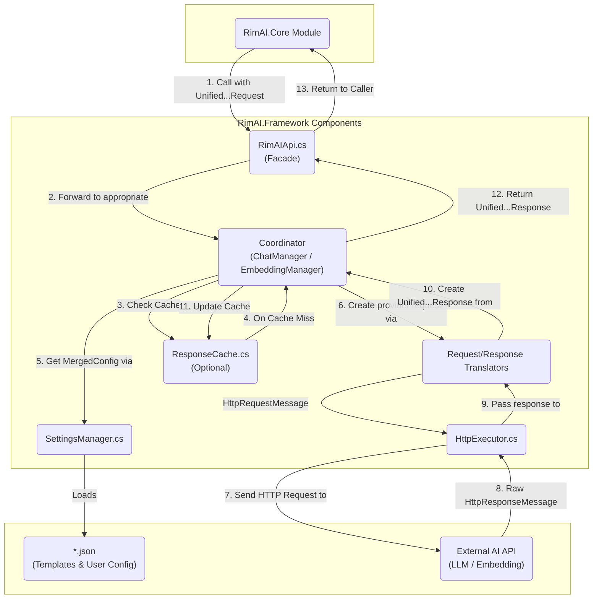

# RimAI.Framework V4.2.1 Architecture Design

## 1. Core Philosophy: An AI API Integration Framework for RimWorld

The RimAI.Framework V4.2.1 is engineered to be a highly flexible, extensible, and data-driven infrastructure for interacting with a wide array of Large Language Model (LLM) and Embedding APIs. Its design is guided by the following core principles:

*   **Provider Template System**: By externalizing API contracts into `provider_template_*.json` files, the framework can adapt to new AI service providers with zero code changes. These templates define not just endpoints and authentication, but also the complete structural mapping of requests and responses.
*   **Unified Internal Models**: All external API calls are translated into standardized internal objects (`UnifiedChatRequest`, `UnifiedEmbeddingRequest`), and all provider responses are translated back into unified internal responses (`UnifiedChatResponse`, `UnifiedEmbeddingResponse`). This decouples the high-level business logic from the low-level implementation details of any specific API.
*   **Clear Separation of Concerns**: The architecture is strictly layered into distinct, single-responsibility components: an API facade, core coordinators (for Chat and Embedding), configuration management, request/response translators, an HTTP executor, and caching.
*   **Comprehensive Feature Support**: The framework offers native support for chat (streaming and non-streaming), JSON mode, function calling, and text embedding.
*   **Intelligent Batch Processing**: It provides automatic, API-aware chunking and batching for embedding requests, and concurrency-controlled batching for chat requests to maximize throughput.
*   **Internal Dependency Injection**: A lightweight, code-based "one-time assembly line" (`FrameworkDI`) is used to construct and wire up all internal components, ensuring high cohesion and low coupling.

## 2. Directory Structure and Component Responsibilities

The V4.2.1 directory structure is designed to enforce separation of concerns and clarify the single responsibility of each component.

```
RimAI.Framework/
└── Source/
    ├── API/
    │   └── RimAIApi.cs                  # [Public API] The static facade for the entire framework, the entry point for all external calls.
    │
    ├── Configuration/
    │   ├── Models/
    │   │   ├── ChatModels.cs            # [Config-Models] Defines configuration models for chat services (templates, user settings, merged configs).
    │   │   └── EmbeddingModels.cs       # [Config-Models] Defines configuration models for embedding services.
    │   ├── BuiltInTemplates.cs          # [Config-Service] Provides built-in provider templates as a code-based fallback.
    │   └── SettingsManager.cs           # [Config-Service] Loads, parses, merges, and manages all provider and user configuration files.
    │
    ├── Core/
    │   ├── Lifecycle/
    │   │   └── FrameworkDI.cs           # [Core-Lifecycle] A lightweight static DI container that assembles all services on startup.
    │   ├── ChatManager.cs               # [Core-Coordinator] The central coordinator for all chat-related logic, handling workflows and concurrency.
    │   └── EmbeddingManager.cs          # [Core-Coordinator] The central coordinator for all embedding-related logic, handling workflows and batching.
    │
    ├── Execution/
    │   ├── Models/
    │   │   └── RetryPolicy.cs           # [Execution-Model] Data model for defining HTTP request retry strategies.
    │   ├── Cache/                       # [Execution-Cache] Unified response cache and in-flight de-duplication
    │   │   ├── ICacheService.cs
    │   │   ├── MemoryCacheService.cs
    │   │   ├── IInFlightCoordinator.cs
    │   │   └── InFlightCoordinator.cs
    │   ├── HttpClientFactory.cs         # [Execution-Infrastructure] Manages the lifecycle of HttpClient instances according to best practices.
    │   └── HttpExecutor.cs              # [Execution-Service] Sends HTTP requests and applies retry policies.
    │
    ├── Shared/
    │   ├── Exceptions/
    │   │   ├── ConfigurationException.cs # [Shared-Exception] Custom exception for configuration-related errors.
    │   │   ├── FrameworkException.cs     # [Shared-Exception] The base exception for all framework-specific errors.
    │   │   └── LLMException.cs           # [Shared-Exception] Custom exception for errors returned by AI services.
    │   ├── Logging/
    │   │   └── RimAILogger.cs             # [Shared-Logging] A simple static logging utility.
    │   └── Models/
    │       └── Result.cs                # [Shared-Model] A generic wrapper for operation results, used to explicitly handle success or failure.
    │
    ├── Translation/
    │   ├── Models/
    │   │   ├── ToolingModels.cs         # [Translation-Model] Defines the unified internal models for function calling.
    │   │   ├── UnifiedChatModels.cs     # [Translation-Model] Defines the unified internal request and response models for chat.
    │   │   └── UnifiedEmbeddingModels.cs # [Translation-Model] Defines the unified internal request and response models for embeddings.
    │   ├── ChatRequestTranslator.cs     # [Translation-Service] Translates a unified internal chat request into a provider-specific HttpRequestMessage.
    │   ├── ChatResponseTranslator.cs    # [Translation-Service] Translates an HttpResponseMessage back into a unified internal chat response.
    │   ├── EmbeddingRequestTranslator.cs # [Translation-Service] Translates a unified internal embedding request into a provider-specific HttpRequestMessage.
    │   └── EmbeddingResponseTranslator.cs # [Translation-Service] Translates an HttpResponseMessage back into a unified internal embedding response.
    │
    └── UI/
        ├── RimAIFrameworkMod.cs         # [UI] The main class for the mod settings window, responsible for rendering the UI and handling user interaction.
        └── RimAIFrameworkSettings.cs    # [UI] Inherits from ModSettings and is responsible for persisting the mod's settings.
```

### The `Contracts` Assembly

The `RimAI.Framework.Contracts` project serves as the **Stable Interface & DTO Layer**:

*   **Provides Reusable DTOs**: It offers unified and reusable Data Transfer Objects (DTOs) like `UnifiedChatModels` and `UnifiedEmbeddingModels` for all components.
*   **Exposes `Result<T>`**: It makes the generic `Result<T>` wrapper available, enabling a consistent error-handling pattern for all callers.
*   **Zero Dependencies**: It has no dependencies on other framework projects and can be safely referenced by `RimAI.Framework`, `RimAI.Core`, and any third-party mods.
*   **Extensibility First**: To extend an API, one must first add or modify the relevant models in the `Contracts` layer before implementing the logic in other layers.

Example Structure:
```text
RimAI.Framework.Contracts/
└── Models/
    ├── Result.cs
    ├── UnifiedChatModels.cs
    ├── UnifiedEmbeddingModels.cs
    └── ToolingModels.cs
```

## 3. Architecture Diagram and Data Flow

The following diagram illustrates the logical data flow for a typical API call. In practice, the flow is orchestrated by a central **Coordinator** (`ChatManager` or `EmbeddingManager`).



## 4. Key Design Decisions and Risk Mitigation

### a. Coordinator Pattern

Each core capability (Chat, Embedding) is managed by a dedicated **Coordinator**. For example, `ChatManager` orchestrates all chat operations. It calls other services in sequence rather than allowing them to call each other, preventing long and tangled call chains.

The flow for `ChatManager` is:
1.  `ChatManager` gets the `MergedConfig` from `SettingsManager`.
2.  `ChatManager` uses `ChatRequestTranslator` to translate the `UnifiedChatRequest` into an `HttpRequestMessage`.
3.  `ChatManager` passes the `HttpRequestMessage` to `HttpExecutor` and receives an `HttpResponseMessage`.
4.  `ChatManager` gives the `HttpResponseMessage` to `ChatResponseTranslator` to get the final `UnifiedChatResponse`.

This pattern ensures that components like translators and executors have a single responsibility and are fully decoupled.

### b. Mandatory Provider Template Validation

The integrity of `ProviderTemplate.json` files is critical to the framework's data-driven approach. To prevent runtime failures due to misconfiguration, `SettingsManager` performs strict validation:

*   **Validate on Load**: After deserializing any `provider_template_*.json` file, it is immediately validated against a required schema.
*   **Clear Error Reporting**: If validation fails, a `ConfigurationException` is thrown, detailing exactly **which file** and **which field** is invalid. This dramatically simplifies debugging for end-users and third-party developers.

### c. Configuration Persistence Boundaries

The requirement to "save a new file based on the user's configuration and a template" is strictly defined as a **Configuration-Time** operation, not a **Request-Time** operation.

*   **Request-Time**: During an API call, the coordinator gets an in-memory `MergedConfig` instance from `SettingsManager`. No file I/O occurs.
*   **Configuration-Time**: When a user saves changes in the Mod Settings UI, the UI-layer code is responsible for persistence. It may choose to update only the `user_config_*.json` or save a new merged file. This logic is completely separate from the core API request pipeline.

### d. Unified Return Type (`Result<T>`) Pattern

To establish a consistent and robust error-handling mechanism, the framework employs the `Result<T>` pattern. Any operation that can fail predictably (e.g., file not found, API error code) returns a `Result` object instead of throwing an exception or returning `null`.

*   **Goal**: To force the caller to explicitly handle failure cases, eliminate `NullReferenceException`s, and make control flow more transparent.
*   **Structure**: A `Result` object contains a success flag (`IsSuccess`), the `Value` on success, or an `Error` on failure.
*   **Application**: All internal service interfaces (e.g., `SettingsManager.GetMergedConfig`, `HttpExecutor.ExecuteAsync`) use `Result<T>` as their return type, creating a predictable and resilient call chain.

## 5. Core Feature Deep Dive: Embedding and Batch Processing

### 5.1 Embedding API Support

Embedding is integrated as a first-class citizen with its own dedicated set of components:

*   **Dedicated Components**: `EmbeddingManager` (Coordinator), `EmbeddingRequestTranslator`, `EmbeddingResponseTranslator`, and `UnifiedEmbeddingModels` (Data Models).
*   **Data-Driven Configuration**: `ProviderTemplate.json` includes an `embeddingApi` section that defines everything needed to interact with the embedding API, including the endpoint, default model, and request/response path mappings for the translators.

**Example `ProviderTemplate.json` (for OpenAI):**
```json
{
  "providerName": "OpenAI",
  "http": {
    "authHeader": "Authorization",
    "authScheme": "Bearer"
  },
  "chatApi": {
    "endpoint": "https://api.openai.com/v1/chat/completions",
    "defaultModel": "gpt-4o",
    "requestPaths": { "model": "model", "messages": "messages" },
    "responsePaths": { "choices": "choices", "content": "message.content" }
  },
  "embeddingApi": {
    "endpoint": "https://api.openai.com/v1/embeddings",
    "defaultModel": "text-embedding-3-small",
    "maxBatchSize": 2048,
    "requestPaths": { "model": "model", "input": "input" },
    "responsePaths": { "dataList": "data", "embedding": "embedding", "index": "index" }
  },
  "staticParameters": {
    "some_static_root_field": "some_value"
  }
}
```

### 5.2 Batch Processing Strategy

The framework uses two distinct strategies to handle batch requests efficiently.

#### a. Native Batching (for Embeddings)

This strategy is used when the underlying API natively supports multiple inputs in a single request, which is common for embedding APIs.

*   **Trigger**: Calling `RimAIApi.GetEmbeddingsAsync(List<string> inputs, ...)`.
*   **Coordinator**: `EmbeddingManager`.
*   **Process**:
    1.  The `EmbeddingManager` gets the provider's `maxBatchSize` from the `MergedConfig`.
    2.  If the input list exceeds `maxBatchSize`, it's automatically split into smaller chunks.
    3.  The manager generates a separate `HttpRequestMessage` for each chunk, containing all inputs for that chunk.
    4.  All requests are sent concurrently.
    5.  The results from all chunks are merged and returned in their original order.

#### b. Concurrency Control (for Chat)

When the underlying API does not support native batching (like most Chat APIs), the framework simulates it using controlled concurrent requests.

*   **Trigger**: Calling `RimAIApi.GetCompletionsAsync(List<UnifiedChatRequest> requests, ...)`.
*   **Coordinator**: `ChatManager`.
*   **Process**:
    1.  The `ChatManager` gets the user-defined `concurrencyLimit` from the `MergedConfig`.
    2.  It uses a `SemaphoreSlim` initialized with the `concurrencyLimit`.
    3.  It iterates through the list of requests, starting a processing task for each.
    4.  Each task must acquire a permit from the semaphore before it can execute.
    5.  The permit is released when the task completes (or fails).
    6.  This ensures that no more than `concurrencyLimit` HTTP requests are in flight at any given time.

---

## 6. UI and Configuration Service Interaction Model

The framework provides a robust configuration UI that works in tandem with the `SettingsManager` service.

The implementation is located in `Source/UI/` and consists primarily of `RimAIFrameworkMod` and `RimAIFrameworkSettings`.

### 6.1 Startup Guard and "Unconfigured" State

*   **"Unconfigured" Mode**: On startup, `SettingsManager` checks for at least one fully valid provider configuration (i.e., a matching pair of `provider_template_*.json` and `user_config_*.json` files, where the user config contains a valid API Key).
*   **Startup Guard**:
    *   If no valid configuration is found, the framework is placed in an **Inactive** state.
    *   In this state, a startup guard intercepts any call to `RimAIApi`, immediately returning an error like `Result.Failure("RimAI Framework is not configured. Please set up at least one AI provider in the mod settings.")`.
    *   This guard prevents any network requests from being attempted in an unconfigured state.
*   **UI Guidance**: The Mod Settings UI detects the "Inactive" state and guides the user to complete the setup for their first provider.

### 6.2 Dynamic Configuration Switching

*   **UI Trigger**: When a user selects a different provider from the dropdown menu.
*   **Query `SettingsManager`**: The UI code calls `SettingsManager` with the new `providerId` to check if a corresponding `user_config_*.json` exists.
*   **Render UI**:
    *   If the file exists, the UI loads the data (API Key, `concurrencyLimit`, etc.) into the input fields.
    *   If it doesn't exist, the UI clears the fields, ready for new input.

### 6.3 Configuration Persistence (Saving)

*   **User-Driven**: Triggered when the user clicks "Save" in the UI.
*   **UI Responsibility**: The UI code gathers the input data and assembles a `UserConfig` C# object.
*   **Write to File**: The UI calls a dedicated `SettingsManager.WriteUserConfig(string providerId, UserConfig config)` method, which serializes the object to its corresponding `user_config_*.json` file.
*   **Reload**: After a successful save, the UI should prompt `SettingsManager` to reload its internal cache to ensure the new settings are used immediately.

This model establishes a clear boundary:
*   **UI (View/Controller)**: Manages user interaction, data collection, and service calls.
*   **`SettingsManager` (Service/Model)**: Handles the low-level logic of reading and writing configuration files and provides a unified view of the configuration state to the rest of the framework.

## 7. Unified Caching System (Framework Layer)

### 7.1 Goals and Ownership

* **Located in Framework**: The generic caching capability lives in the Framework layer and is orchestrated by `ChatManager` / `EmbeddingManager`. The Core layer no longer performs generic result caching and only keeps domain-specific indices and optional pseudo-stream slicing.
* **One Implementation, Global Reuse**: A single, unified caching and in-flight de-dup solution for Chat (streaming/non-streaming) and Embedding, avoiding duplicated efforts and inconsistent behaviors across modules.

### 7.2 Capabilities

* **Key Strategy**:
  - Chat Key = Fingerprint(providerName, endpoint with apiKey placeholder removed, model) + Conversation scope + Canonicalized request summary.
    - Conversation scope: `conv:{sha256(conversationId)[0..15]}`. `UnifiedChatRequest.ConversationId` is mandatory and scopes cache hits to a single dialogue.
    - Canonicalized request summary includes: `messages[role, content, tool_call_id, tool_calls]`, tool definitions, JSON mode, temperature/sampling/length parameters, template `StaticParameters` and user overrides.
    - Ignore the `stream` flag so streaming and non-streaming versions of the same semantic request hit the same cache item.
  - Embedding Key (per input) = providerName + model + sha256(normalize(text)).
  - Keys never contain `apiKey` or sensitive header values.
* **Storage Policy (TTL/L1/L2)**: Short default TTL (60–300 seconds, configurable), failures are not cached. Provide an in-memory L1 implementation; an optional disk-based L2 can be added later.
* **In‑Flight De‑Duplication**: For non-streaming requests, concurrent calls with the same key are coalesced into a single upstream call; all await and reuse its result.
* **Invalidation**:
  - On Provider/Model changes or settings saved: invalidate by namespace (e.g., `chat:{provider}:{model}:*`, `embed:{provider}:{model}:*`).
  - Conversation-level invalidation: invalidate by prefix `chat:{provider}:{model}:conv:{convShort}:*` to clear cache for a single dialogue only.
* **Observability**: Track hit rate, coalesced request counts, and saved requests/latency for future UI surfacing and tuning.

### 7.3 Streaming Compatibility

* On cache hit: immediately emit a pseudo-stream by slicing the cached full `UnifiedChatResponse.Message.Content` into `UnifiedChatChunk`s; the final chunk carries `FinishReason` and potential `ToolCalls`.
* On cache miss: perform true streaming; do not cache mid-stream chunks. After a successful final aggregation, write the full response to cache.

### 7.4 Embedding Granularity and Batch Coordination

* Cache at the per-input granularity. For batch requests, de-duplicate and index inputs, check cache first, request only the misses using `MaxBatchSize`, then write back per input and reassemble in the original order for `UnifiedEmbeddingResponse`.

### 7.5 Directory and Components (Execution/Cache)

* `ICacheService`, `MemoryCacheService`: Unified cache interface and L1 in-memory implementation (thread-safe with expiration).
* `IInFlightCoordinator`, `InFlightCoordinator`: Per-key concurrency coalescer.
* `CacheKeyBuilder` (optional): Build Chat/Embedding keys and provide canonical JSON serialization.

### 7.6 Risks and Security

* Carefully craft key composition to avoid cross-context collisions; optionally incorporate external dimensions like `saveId/worldId` into the namespace.
* Do not cache failures or non-2xx responses; do not write sensitive data to disk. Provide configuration toggles `cacheEnabled` and `cacheTtlSeconds` (in a future version).

